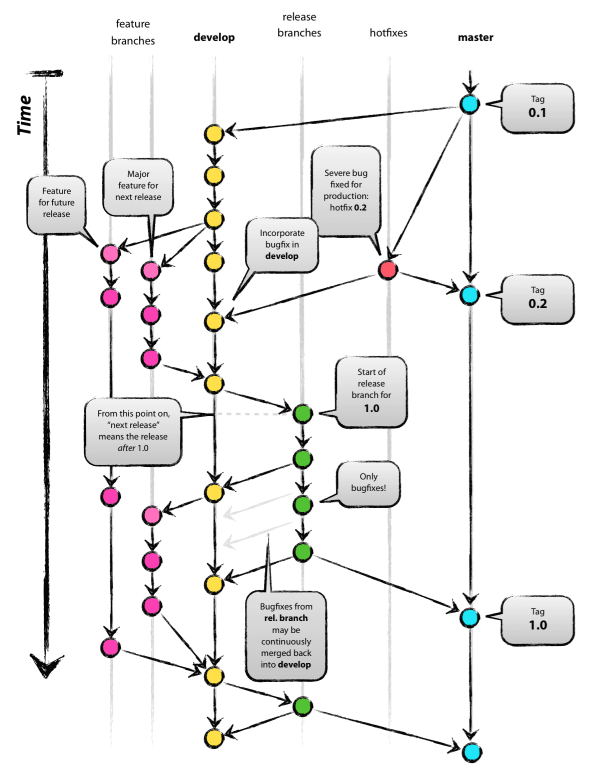

# 1/16 Git 초급 교육

## 이론

- 버전 관리 시스템

  기존 <u>로컬 버전 관리 시스템</u>은 여러 명이서 프로젝트 진행시에 사용이 불가능

  <u>중앙집중식 버전 관리 시스템</u> : 파일 저장 서버 & 다수 클라이언트 

  > 장점 : 누구나 다른 사람 업무를 알 수 있음
  > 단점 : 중앙 서버 잘 못 되는 경우 모두 잘못. 서버 다운동안 업무 불가

  <u>분산 버전 관리 시스템</u> = **Git**!

  

### Git

#### Git이란? 

- git의 역사 : 리눅스 bitkeeper가 무료 사용이 취소되어 리눅스 개발 커뮤니티가 자체 도구 개발 

- git의 목표 : 빠른 속도, 단순 구조, 비선형 개발, 분산형, 대형 프로젝트에도 유용

- git의 속성 : 

  | Subversion                                                   | Git                                                          |
  | ------------------------------------------------------------ | ------------------------------------------------------------ |
  | 파일 변화를 시간 순으로 관리한다. 변경 사항만 저장하므로 버전으로 이동 속도가 느리다. | 파일의 스냅샷 저장으로 버전으로의 이동 속도가 빠르다. 거의 모든 명령을 로컬에서 실행하며,  서버에 변경을 반영하고 받아오는 경우만 온라인으로 실행한다. |

  - 무결성 : 모든 데이터를 저장하기 전 해시 체크섬을 통해 체크섬으로 데이터 관리
  - tracked 세가지 상태 : 
    - committed(데이터가 로컬 디비에 안전 저장) 
    - modified(수정 파일을 아직 로컬 디비에 커밋 안함) 
    - staged(수정한 파일을 곧 커핏한다 표시)

  >  tracked : ''버전 관리''를 하는 상태. 이 경우에만 위의 세가지 상태가 존재한다.

- gitignore file : 
  빌드 결과물이나 임시파일 등은 버전관리를 하지 않는다.

  이 경우 '.gitignore'라는 파일을 생성하여 무시할 파일 유형을 작성한다. (gitignore 작성 site : www.gitignore.io)

  이미 commit되어 버전 관리가 되고 있는 파일은 gitignore에 추가해도 무시되지 않는다.

  따라서, 해당 파일을 삭제 후 commit해야 한다. 

  

#### Branch

가상의 작업 공간을 생성한다. (tag과 같이)일종의 커밋을 가리키는 포인터이다.

- Merge : 
  merge를 할 경우 변동 되는 곳으로 checkout이 필요하다.

  > 즉, test -> master로 merge하고 싶은 경우, master가 변동 되므로 master로 체크아웃 후 merge한다.
  > 단, merge 시 충돌이 발생하지 않도록 master와 branch에서 서로 다른 파일을 수정한다. 

##### Git Flow - support branch

 - **feature** branch : 
   - 특정 기능 하나를 생성. 
    - 'develop'에서 생성 후 merge.
    - 'feature/' merge시 fast forward가능 해도 새로운 commit 생성.
 - **release** branch : 
   - 간단 버그 수정. 메타 데이터 변경.
    - 'develop'에서 생성 후 'develop' & 'master'로 merge.
    - master에 버전 태그.
- **hotfix** branch : 
  - 배포된 버전에 긴급 변경 사항이 있을 때.
  - 'master'에서 생성 후 'develop' & 'master'로 merge
  - master에 버전 태그.

#### remote(원격 저장소)

사용자가 github의 저장소를 복제하는 경우, git은 자동으로 github에 있는 원격저장소를 origin으로 추가한다.

Git이 origin/master를 체크아웃해 로컬 브랜치인 master를 생성.

(즉, 원격저장소는 origin/master, 로컬 브랜치는 master이며 둘은 별개의 branch이다)

> **Fetch** : 원격 저장소의 변경 사항을 내려 받는 것. 
>
> ​			 fetch를하면 변경 사항을 내려 받지만 아직 로컬 브랜치에는 반영되지 않는다.
>
> **Pull** : fetch+merge
>
> **Push** : 로컬 저장소의 변경 사항을 원격 저장소로 올리는 것.

## 실습

### 기능 개발 순서

1. Git Flow -> 새 기능 시작 하여 feature branch를 생성하고, 해당 branch로 checkout한다.

2. 기능 개발 후, commit & push를 진행한다.

3. Github page에서 Pull request를 생성한다. 

   > 이 때, Pull request 제목에 {#프로젝트 업무 번호}를 통해 프로젝트 댓글로 알림을 보낼 수 있다.

4. 코드 리뷰 후 다시 commit & push를 진행하면, 기존 pull request의 commit으로 달린다.

5. 코드 리뷰가 완료 되면 merge pull request를 진행한다. 

6. 로컬에서 원격 저장소의 develop과, 로컬 저장소의 develop을 각각 fetch, pull한 후, feature branch를 삭제한다.

### 참고사항

initial readme 체크 안하면 '공간'만 생성된다.

commit message는 최대한 상세하게 작성하자.

<u>feature branch를 생성하기 전에 항상 fetch를 통해 변경 사항이 없는 지 확인하자.</u>

git에 익숙해지고, 잘 다룰 수 있다면 'rebase'를 배워서 활용해보자.

'마지막 commit 정정' 기능으로 파일 추가 수정도 가능하다.

'commit 되돌리기' 기능으로 이전 변경사항을 없앨 수 있다. -> <u>즉 기능 단위로 개발을 해야 한다!</u>

source tree 이 외에 fork 프로그램도 괜찮다.