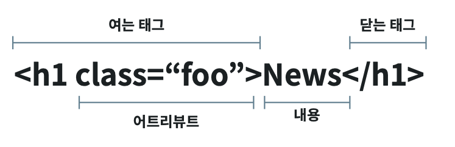
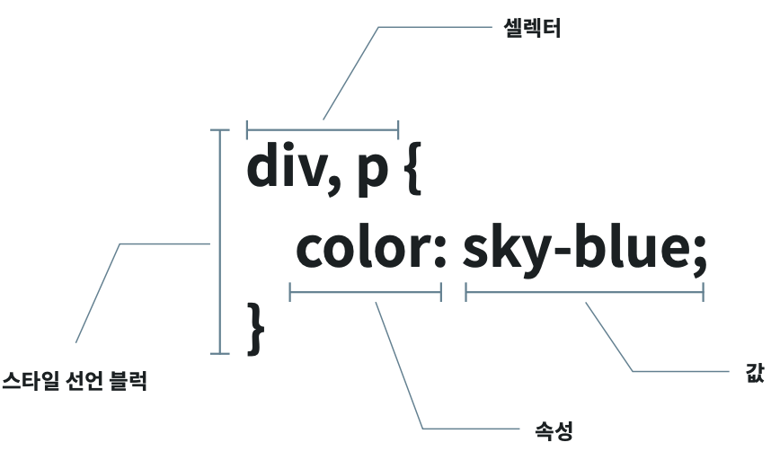
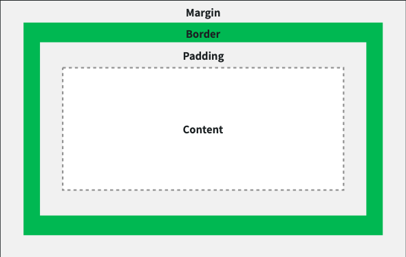

# 1/17 Html&CSS basic

- 웹의 구성 요소
  - html : 구조와 내용. 내용 서술하고 정의
  - css : 모양과 표현. 디자인을 입히는 개념 
  - js : 기능과 액션. HTML문서 안의 동작을 추가. 데이터 로드 등


## HTML



### HTML문서 구조

- DOCKTYPE
- html 
  - lang 속성 : 웹 접근성을 준수하기 위한 속성이다.
- head
- meta : 문서에 대한 정보 요약으로 사용자에게는 보이지 않는다.
  - 인코딩 설정, IE호환성 등
  - Open Graph Protocol : 페이지에 대한 요약 정보를 설정한다. 
- body 


### 기본 태그 

- h1 ~ h6 
- p 
- ol & li / ul & li
- strong, em : 굵게, 기울임
-  blockquote : 인용구
- pre : 지정된 서식 그대로 표현
- code : monospace 글꼴로 표현. (모든 글짜의 너비가 똑같아서 주로 code에 사용)
- a : 하이퍼링크
  - href 속성 : 이동 주소
  - target 속성 : "_blank"설정 시 새 창으로
- img
- div : 영역 나누기


### Semantic Element

'의미가 있는 태그'로 개발자의 가독성을 위해 사용한다.

검색 엔진이 논리적으로 필요한 부분을 찾기 쉽다.

| Tag         | Role                                                         |
| :---------- | :----------------------------------------------------------- |
| **header**  | 문서의 헤더 부분 - 소개나 탐색을 돕는 것의 그룹              |
| **main**    | 주요 콘텐츠가 들어가는 부분                                  |
| **nav**     | 문서의 네비게이션 구조                                       |
| **aside**   | 사이드에 위치하는 공간                                       |
| **section** | 문서의 일반적인 구획, 여러 중심 내용을 감싸는 공간           |
| **footer**  | 문서의 푸터 부분 작성자 구획, 저작권 데이터, 관련된 문서의 링크에 대한 정보 |
| **figure**  | 문서의 멀티미디어 요소                                       |
| **article** | 글자가 많이 들어가는 부분(그 자체로 독립적으로 구분되거나 재사용 가능한 영역) |
| **address** | 연락처 정보 등의 부가 정보                                   |


## CSS 기본과 selector

*Cascading Style Sheet.* 문서의 레이아웃과 스타일을 정의한다.




### 적용 방법

- inline : 각 태그마다 스타일을 모두 적용한다. 우선순위가 가장 높고, 거의 사용하지 않는다. 
- 내부 Embedded : css많지 않을 경우 종종 사용한다.
- 외부 External : css파일을 별도로 분리하는 가장 일반적인 방식이다.


### 상속

부모에 선언된 스타일이 자식에 영향을 미치는 것이다.

다만, 모든 속성에 상속되지는 않고 똑똑하게 상속한다.

> ex) 상속 되는 속성 : visibility, opacity, font, color, line-height, text-align, white-space ...
>
> ex) 상속 되지 않는 속성: margin, padding, border...


### selector

1. tag selector

   ```css
   p {
   	color: blue;
   }
   ```

2. id selector

   ```css
   #hello {
   	color: blue;
   }
   ```

3. class selector

   ```css
   .hello {
   	color: blue;
   }
   ```


#### selector - 부모자식 관계

```css
header h1{
	//부모 자손 관계
}
header > p{
	//부모 자식 관계
}
h1 + p{
	//바로 뒤 형제
}
h1 ~ p{
s	//뒤에 오는 모든 형제
}
```

#### selector - 유사 클래스

| 이름                      | 설명                       |
| :------------------------ | :------------------------- |
| :hover                    | 마우스오버                 |
| :active                   | 클릭된 상태                |
| :focus                    | 포커스가 있을 때           |
| :checked                  | 체크상태일 때              |
| :disabled                 | 사용불가능일 때            |
| :first-child, :last-child | 해당요소 중 첫번째, 마지막 |
| :nth-child(n)             | 해당요소 중 n번째          |
| :nth-of-type(n)           | 해당요소 중 n번째 태그     |
| :not(선택자)              | 해당요소가 아닌 것들       |

#### selector - 유사 엘리먼트 

| 유사 엘리먼트 셀렉터 | 설명               |
| -------------------- | ------------------ |
| ::first-letter       | 첫 번째 글자       |
| ::first-line         | 첫 번째 줄         |
| ::before             | 엘리먼트 내용의 앞 |
| ::after              | 엘리먼트 내용의 뒤 |
| ::selection          | 선택된 글자        |


### CSS 우선순위

- 클래스 셀렉터 > 태그 셀렉터
- 이후에 선언된 스타일 > 이전에 선언된 스타일
- 우선순위는 포함된 점수를 더해서 계산 
  - inline : 1000
  - id : 100
  - 클래스, 속성, 유사 클래스 : 10
  - 태그, 유사 엘리먼트 : 1


## CSS 박스 모델

### CSS 박스 모델 구성요소



- background-clip : border-box / padding-box / content-box / text;

- box-sizing : content-box / border-box;

-  width, height
  - auto : content사이즈 만큼 자동으로 지정한다.
  - max-width, min-width : 최대, 최소를 지정한다.

- margin

- padding
- border


### CSS display

- block : 한 줄을 모두 차지한다. width, height, margin, padding이 모두 동작한다.

  ```css
  p {
  	margin: 0 auto;	//가로 가운데 정렬
  }
  ```

- inline : 여러 요소가 한 행에 있을 수 있다. width, height, margin이 동작하지 않으며, content길이 만큼의 width를 갖는다.

  ```css
  .parent {
  	text-align: center; //부모에서 text-align 사용하여 가운데 정렬
  }
  ```

- inline-block : 여러 요소가 한 행에 있을 수 있으며 width, height, margin, padding이 모두 동작한다.

  ```css
  .parent {  
  	text-align: center; //가운데 정렬
  }
  ```

- none 
  
  ```css
  p {
  	display: none; //해당 요소를 화면에서 보이지 않게 한다.
  }
  p {
  	visibility: hidden;	//해당 요소를 화면에서 보이지 않게 하지만, element의 영역은 동일하게 유지한다.
  }
  ```
  
  

### CSS flexible 박스

- 부모: "display: flex" 를 적용한다. 

- 자식: "flex : {숫자}" -> 숫자 비율만큼 공간 차지한다.

  ​		"flex: none" -> 원래 지정된 공간만큼 차지한다.  

```css
.container {
	display: flex;
	flex-direction: column;
}

.child:nth-child(1) {
	flex: 1;
}
.child:nth-child(2) {
	flex: none; 
}
```


## 가로 / 세로 정렬

#### block

```html
<div class="box">box</div>

.box {
	margin: 0 auto;
}
```

#### inline

- 가로 정렬 : <u>부모의 text-align 속성</u>을 사용하여 조절한다.
- 세로 정렬 : <u>line-height 속성</u>을 사용하여 조절한다.

```html
<div class="parent">
  <span class="inline">Inline</span>
</div>

.parent {
	text-align: center;	//부모에서 text-align 사용하여 inline 가로 정렬
}
.inline {
	line-height: 30px;	//line-height를 조절하여 inline 세로 정렬
}
```

#### flex 가로 / 세로 정렬

- **justify-content** : flex-direction과 <u>같은 방향</u>으로 정렬한다.
- **align-items** : flex-direction과 <u>수직 방향</u>으로 정렬한다.

> 가운데 정렬을 할 경우 : 두 속성 모두 center로 주면 된다.

```css
.container {
	display: flex;
	align-items: center;
	justify-content : center;
}
```


## 포지션과 오버플로우 속성

#### position

- static : 기본 포지션 값

- relative : 원래 위치를 기준으로 이동

- absolute : relative를 가진 가장 가까운 상위 element를 기준으로 이동(없으면 body기준)

  ​				 자신의 원래 공간이 사라짐

- fixed : transform을 가진 가장 가까운 상위 element를 기준으로 이동(없으면 화면 기준)

  ​		   자신의 원래 공간이 사라짐

#### overflow

- visible : 내용을 자르지 않고 보여준다.
- hidden : 넘는 내용을 잘라낸다.
- scroll : 가로, 세로 스크롤바를 항상 노출한다.
- auto : 내용이 넘는 경우만 스크롤바를 노출한다. 

#### text-overflow 

텍스트가 부모요소를 벗어났을 때 말줄임 표시를 위해 사용한다. 한 줄로 ... 말줄임을 표시할 수 있다.

```css
.container {
	overflow: hidden;
	text-overflow: ellipsis;
	white-space: nowrap;
}
```


## 글자 속성

#### element 크기단위

| 단위   | 설명                            |
| :----- | :------------------------------ |
| px     | 화소 단위                       |
| em     | 부모 요소의 글자 크기 기준 배율 |
| rem    | HTML 글자 크기 기준 배율        |
| pt     | 글꼴에 많이 쓰임                |
| %      | 기본 글꼴의 상대적인 크기       |
| vw, vh | 뷰포트 기준 너비, 높이          |

#### font

| 속성        | 설명                 | 값                                             |
| :---------- | :------------------- | :--------------------------------------------- |
| font-style  | 글자 스타일          | normal \| italic \| oblique                    |
| font-weight | 글자 굵기            | lighter \| normal \| bold \| bolder \| 1 ~ 100 |
| font-size   | 글자 크기            | <숫자> <단위>                                  |
| font-family | 글꼴                 | 글꼴 이름                                      |
| line-height | 글자가 차지하는 높이 | normal \| <숫자> \| <숫자><단위>               |


#### 교육 내용 출처: NHN  기술교육 - 1/17 HTML&CSS 기초 (성슬기 선임, 최민호 선임)