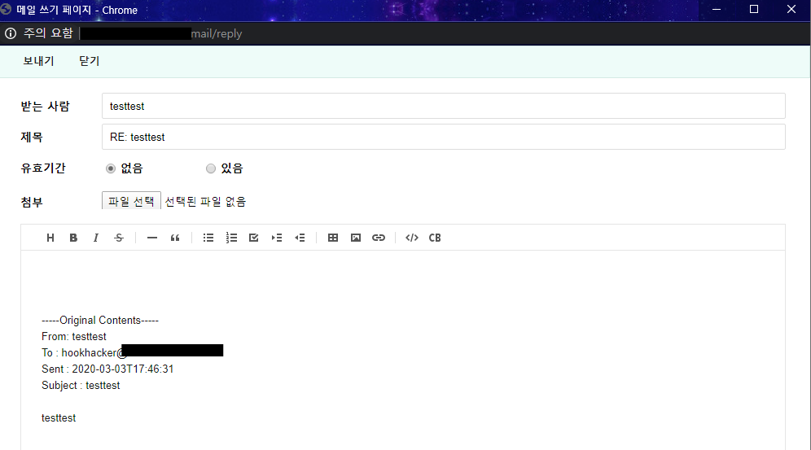

# MooNMail Project [QA/개선사항] 답장하기 시 송신자 정보가 일부만 들어감

**AS-IS**

- 답장하기 버튼 클릭 시 송신자 정보가 수신인으로 들어가는데, moonmail 내부 메일일 경우 도메인 부분이 없음

기존 우리 문메일 서비스는 우리 도메인인 사용자의 도메인을 따로 저장하지 않았다. 수신자나 송신자 모두에 해당했는데, 따라서 메일을 볼 때 우리 도메인 사용자의 정보에는 도메인이 따로 드러나지 않았다. 또한, 답장을 할 때는 메일에 보여지는 송신자를 기준으로 했었다. 

기존에 우리 도메인끼리 통신할 때는 메일 조회 시 도메인이 들어나지 않거나, 전송 시 도메인이 없는 것이 크게 문제되지 않았지만, 타 사이트와 통합하면서, 메일 전송 시 도메인도 입력이 필요해졌다. 따라서 해당 부분은 개선할 필요가 생겼다.

해당 부분 구현에서 데이터를 저장할 때 도메인을 다 저장하도록 할 지 혹은 보여줄 때만 처리할 지를 고민했는데, 데이터 저장방식을 변경하면 그 외 sql문 등을 변경하는 등 다른 부분의 변경이 많을 거라는 생각이 들었다. 따라서 보여줄 때 도메인 여부를 확인 후 없다면 우리 도메인을 판단하고 처리해주도록 변경했다. 

