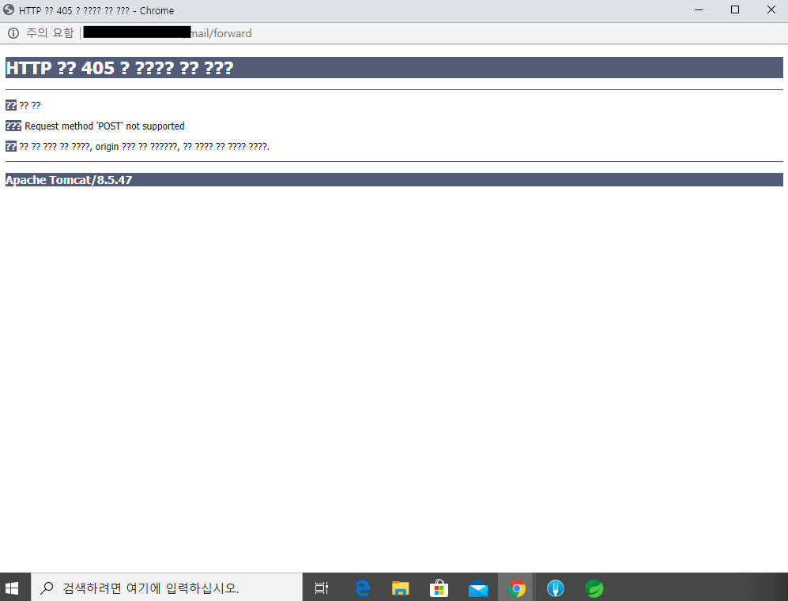

# MooNMail Project [QA/버그] 전달, 답장 기능 미동작 

**[테스트 환경]**

OS 및 브라우저 버전: 윈도우10, 크롬

**[재현 방법]**

유효기간이 설정 된 메일의 전달하기 버튼 누르기, 답장하기 버튼 누르기

**[오류 내용]**

오류 화면은 위와 같고 먼저 해당 오류가 나는 원인을 찾아 보았다. 답장, 전달 기능이 어떤 메일에서는 동작하고, 어떤 메일에서는 동작하지 않는 것을 확인했고, 타 사이트 통합의 문제인지, 혹은 다른 문제인지 찾기 위해 타 사이트와 메일을 여러 개 주고받았다. 하지만 타 사이트의 문제는 아니었고, 혹시 DB 저장에 문제가 있는지 DB도 찾아보았지만, 역시나 DB 저장의 문제도 아니었다. 메일을 여러 개를 시험해본 결과 유효기간이 설정 된 메일일 경우에 발생하는 문제 였다는 것을 발견했다. 

해당 문제의 원인은 유효기간을 parsing 하는 부분에서 발생한 오류였다. general controller를 사용하여 타 사이트와 통신하는 과정에 유효기간 데이터타입 및 로직을 수정할 필요가 있었고, 해당 과정에서 미처 발견하지 못했던 부분이었다. 

결국 유효기간 parsing을 일부 수정하는 것으로 문제를 해결할 수 있었다.