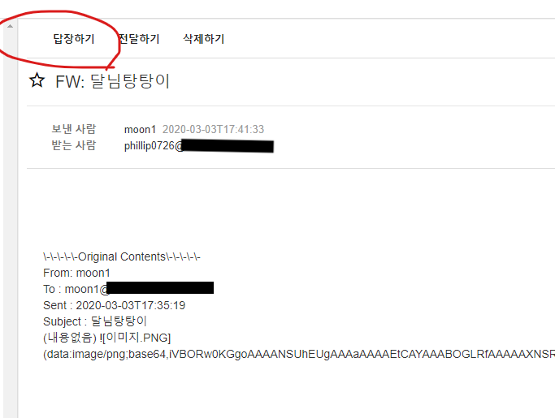

# MooNMail Project [QA/개선사항] 보낸메일함의 답장하기

**AS-IS**

- 보낸 메일의 답장하기 기능이 불필요

기존 보낸메일함에서 메일을 클릭하여 메일 상세 조회를 했을 때, 메일의 상단에 답장하기 버튼이 있는 것이 어색하다고 판단이 되었다. 따라서 메일 상세 조회 시에 보낸 메일인지, 받은 메일인지 여부를 확인하여 보낸 메일의 경우 답장하기 버튼을 없애도록 수정했다. 

해당 부분을 구현할 때, 메일함을 보고 처리를 할 지, 메일 자체의 보냄 받음 여부를 보고 처리 할 지를 고민했다. 하지만 중요 메일함이나 검색 기능의 경우 받은 메일과 보낸 메일이 섞여서 보여지기 때문에 두 번째 방식을 선택했다. 결과적으로 메일함과 상관없이 보낸 메일의 경우 답장하기 버튼이 생성되지 않도록 수정했다. 