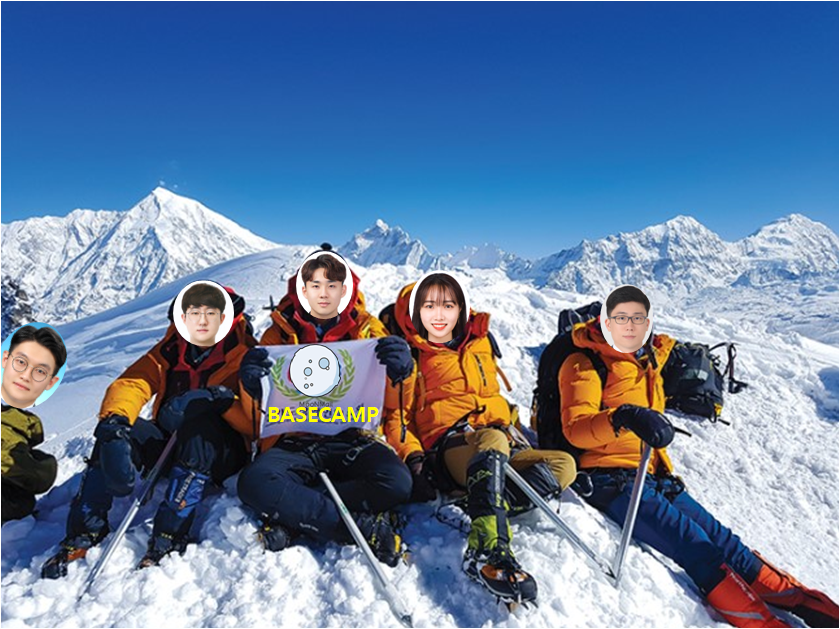

## Basecamp를 마치며

NHN Basecamp는 Rookie로 들어온 신입사원들이 약 9주 간의 절차 동안 기술을 배우는 과정이다. 운 좋게도 NHN에 2020년 루키 7기로 입사하게 되었고,  첫 10일 동안 인사팀과 간단한 OT 후, 기술 교육을 시작했다. Basecamp는 1/13 ~ 3/13일까지 진행되었고, 그 동안 루키달님TF에 속하게 되었다. 

우리 루키달님TF는 정말 재미있는 팀이었다. 개인적으로 생각했을 때, 루키 7기의 팀들 중 우리 팀이 가장 서로 돈독했고, 재밌게 일했다고 자부할 수 있다. 우리 팀은 야근도 많이했지만, 다른 팀원이 할 일이 있으면 서로 나눠하며 자진해서 같이 야근을 하기도 했다. 그래서 야근이 그렇게 싫지 않았고, 같이 퇴근하고 판교역까지 걸어가는 길이 정말 즐거웠다. 

Basecamp를 처음 시작할 때는 걱정과 근심이 많았다. 웹 서비스를 한 번도 개발해본 적이 없었기 때문이었다. 그래서 교육 시간에 세세한 것 부터 하나씩 가르쳐주셨을 때 정말 다행이라는 생각을 했고, 열심히 배우려 노력했다. Basecamp기간의 과제는 메일 서비스 였고, 우리 팀의 메일 서비스는 팀이름을 따서 **'MooNMail'**이다. 우리는 basecamp동안 교육을 받으면서 MooNMail 서비스를 <u>기획, 설계, 개발, 운영</u>까지 차례로 진행해 보았다. 

9주 간의 basecamp는 실제 회사생활에서 해야하는 업무들을 단적으로 가볍게 보여주는 것에 불과하다. 하지만 실제 회사에서 업무나 서비스가 어떻게 진행이 되는지를 전혀 몰랐던 신입사원에게는 가장 필요하고, 가장 적절했던 교육이라는 생각이 들었다. 사실 100프로 모든 것을 이해하고 흡수했다고 할 수는 없지만 그래도 이번 교육을 계기로 적어도 이 후  업무에서 무엇을 할 줄 알아야하고, 무엇을 더 배워나가야 하는 지, 무엇을 모르는 지에 대해 알 수 있게 된 것으로도 큰 한 걸음이라고 생각한다. 

OT를 거치고 basecamp를 진행하면서 <u>인사팀분들, 운영진분들과 멘토님</u>에게도 정말 많은 도움을 받았다. 꾸준히 챙겨주시고, 신경써주시고, 모르는 건 언제든지 물어보라며 격려해주셔서 너무 감사했다. 덕분에 회사라는 새로운 환경에 놓여졌을 때 잘 적응할 수 있었던 것 같다. <u>Basecamp는 회사에 적응하고, 회사의 업무를 배우고, 동기들과 친해질 수도 있는 기회</u>였다. 처음 설명해주신 대로 이 후에 각자 부서에 배치되고 실제 회사생활을 시작하기전 기초, 가장 기본이 되는 것을 다져주는 역할을 제대로 해 준 것 같다. Basecamp를 겪으며 배운 것들로 앞으로 더 성장해 나가야겠다는 다짐이 들었고, 서로 의지하고 도와줄 수 있는 그런 동기들이 생겨서 너무 행복한 시간이었다. 

#### 다들 너무 감사했고, 앞으로도 잘 부탁드립니다 :)

